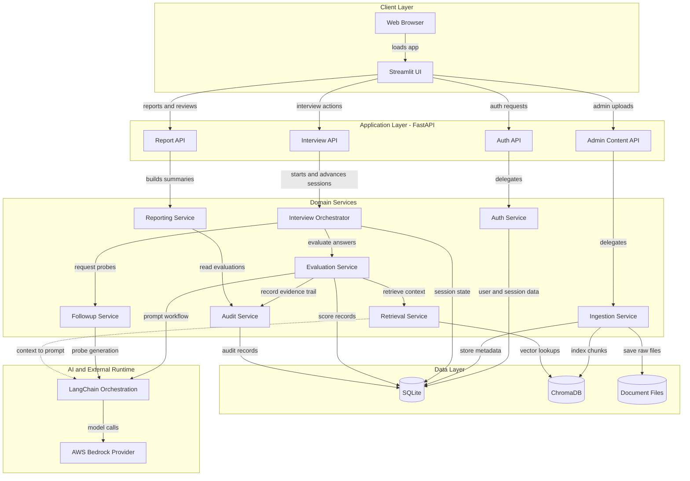
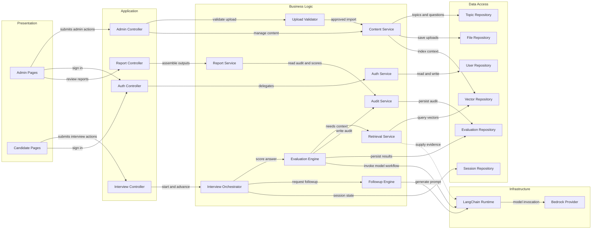

# Application Architecture

This document captures the target MVP architecture for the AI Interview Tool based on the current product requirements, upload specifications, and evaluation schema contracts. It shows both the high-level runtime architecture and the main component relationships inside the application.

## Application Architecture

<!-- mermaid-checked: no \n, no em-dash/en-dash, no {} in labels, subgraphs are id["label"], arrows are -->|"label"|, all subgraphs closed by end, ids unique -->

### Technology Stack Summary

| Layer | Technology | Version | Purpose |
| --- | --- | --- | --- |
| Client | Streamlit | MVP target | Candidate and admin web experience |
| API | FastAPI | MVP target | Application services and route boundaries |
| Domain Services | Python services | MVP target | Interview orchestration, scoring, ingestion, reporting, and audit logic |
| Transactional Data | SQLite | MVP target | Users, topics, sessions, answers, evaluations, and audit records |
| Retrieval Data | ChromaDB | MVP target | Vector storage for approved contextual reference content |
| AI Orchestration | LangChain v1 | Planned | Prompt orchestration and provider abstraction |
| Model Runtime | AWS Bedrock | Planned | Managed model access through provider abstraction |

### Data Storage and External Services

The MVP uses SQLite as the primary transactional store for users, topics, questions, sessions, answers, evaluations, and audit data. ChromaDB stores vectorized chunks of approved contextual source material used during answer evaluation. Uploaded source files, especially PDFs, are retained in a document file store so ingestion provenance and later review remain possible. LangChain mediates prompt construction and evaluation workflows, while AWS Bedrock provides the underlying model runtime.

### Key Architectural Decisions

- Keep Streamlit thin and route all core business logic through FastAPI-owned services so the UI can be replaced later without rewriting evaluation behavior.
- Separate transactional persistence from retrieval persistence: SQLite owns system records, while ChromaDB owns contextual chunks and vector search.
- Preserve an explicit audit trail for every evaluation decision, including retrieved evidence, thresholds, follow-up usage, and model metadata.

## Component Relationships

<!-- mermaid-checked: no \n, no em-dash/en-dash, no {} in labels, subgraphs are id["label"], arrows are -->|"label"|, all subgraphs closed by end, ids unique -->

### Component Inventory

| Component | Layer | Type | Responsibility |
| --- | --- | --- | --- |
| Admin Pages | Presentation | Streamlit pages | Topic setup, uploads, threshold configuration, and report review |
| Candidate Pages | Presentation | Streamlit pages | Login, interview flow, follow-up answers, and feedback display |
| Auth Controller | Application | FastAPI route set | Authentication and session entry points |
| Admin Controller | Application | FastAPI route set | Upload, preview, publish, and content management endpoints |
| Interview Controller | Application | FastAPI route set | Interview session lifecycle and answer submission endpoints |
| Report Controller | Application | FastAPI route set | Session summaries and admin review endpoints |
| Auth Service | Business Logic | Service | Credential validation and role-aware access control |
| Upload Validator | Business Logic | Service | Structured file validation and preview generation |
| Content Service | Business Logic | Service | Topic, question, rubric, and context ingestion orchestration |
| Interview Orchestrator | Business Logic | Service | Session state transitions and branching into evaluation or follow-up |
| Evaluation Engine | Business Logic | Service | Rubric scoring, confidence calculation, and evidence-driven evaluation |
| Followup Engine | Business Logic | Service | Follow-up question generation with max-3 enforcement |
| Retrieval Service | Business Logic | Service | ChromaDB search over approved contextual content |
| Report Service | Business Logic | Service | Candidate summaries and admin review projections |
| Audit Service | Business Logic | Service | Persistence of thresholds, evidence links, model metadata, and evaluation trace |
| User Repository | Data Access | Repository | Users, credentials, and role-related persistence |
| Topic Repository | Data Access | Repository | Topics, questions, contexts, and rubric metadata |
| Session Repository | Data Access | Repository | Interview sessions, answers, and follow-up sequence state |
| Evaluation Repository | Data Access | Repository | Evaluations, audit records, and reporting projections |
| Vector Repository | Data Access | Repository | Context chunk indexing and retrieval lookup |
| File Repository | Data Access | Repository | Raw uploaded file metadata and source file access |
| LangChain Runtime | Infrastructure | Orchestration runtime | Prompt assembly, structured response parsing, and provider abstraction |
| Bedrock Provider | Infrastructure | External runtime adapter | Managed model invocation through AWS Bedrock |