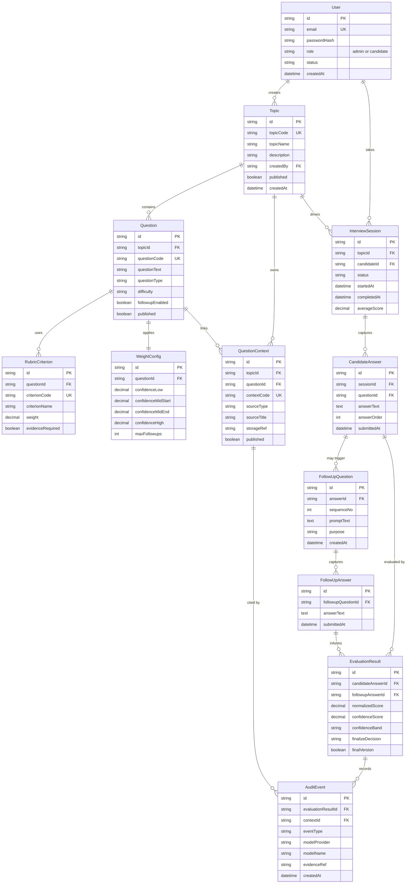

# Entity Relationship Diagram

This document describes the core data model for the AI Interview Tool MVP. It focuses on the transactional entities that support admin content management, interview execution, answer evaluation, follow-up probing, and auditability, while also showing how contextual retrieval data connects back to those records.

## Entity Model

<!-- mermaid-checked: every attribute is `<type> <name> [<key>] ["<description>"]` with at most one of PK/FK/UK, no \n in descriptions, no {} in descriptions, every relationship label is double-quoted -->

## Entity Summary

| Entity | Responsibility | Notes |
| --- | --- | --- |
| User | Authentication, authorization, and actor identity | Supports both admin and candidate roles |
| Topic | Groups interview questions into a business domain or role track | Owned by admins and published for candidate use |
| Question | Core interview prompt with metadata and runtime settings | Links to both rubric and context |
| QuestionContext | Approved contextual source used by retrieval and evidence grounding | May originate from CSV, JSON, Excel, or PDF ingestion |
| RubricCriterion | Individual scoring criterion for a question | Supports weighted, evidence-aware scoring |
| WeightConfig | Thresholds and follow-up control settings per question | Drives the mid-confidence follow-up branch |
| InterviewSession | Candidate interview run for a topic | Aggregates answers and final reporting |
| CandidateAnswer | Primary answer submitted by the candidate | Starting point for scoring and possible follow-up |
| FollowUpQuestion | System-generated probe for ambiguous or incomplete answers | Maximum of 3 per primary answer |
| FollowUpAnswer | Candidate response to a follow-up question | Feeds rescoring logic |
| EvaluationResult | Initial and rescored evaluation output | Supports multiple versions for the same candidate answer |
| AuditEvent | Evidence and model traceability record | Ties evaluation decisions back to retrieved context and model metadata |

## Data Ownership Per Store

| Store | Entities or Records Owned | Purpose |
| --- | --- | --- |
| SQLite | User, Topic, Question, RubricCriterion, WeightConfig, InterviewSession, CandidateAnswer, FollowUpQuestion, FollowUpAnswer, EvaluationResult, AuditEvent | Transactional source of truth for system behavior and reporting |
| ChromaDB | Context chunks, embedding metadata, retrieval references | Retrieval store for approved contextual evidence |
| Document Files | Raw uploaded PDF and structured import files | Provenance, review, and reprocessing source |

## Relationship Notes

- A topic owns many questions and can also own topic-level context that applies across those questions.
- Each question owns rubric criteria and exactly one weight configuration record in the MVP design.
- A candidate answer may trigger up to 3 follow-up questions, each with its own follow-up answer.
- Evaluation results are versioned so both the initial and final rescored evaluation can be preserved.
- Audit events point to both the evaluation result and the cited context so admins can review why a score was assigned.

## Sensitivity and Access Notes

| Entity | Sensitive Fields | Classification | Controls Needed |
| --- | --- | --- | --- |
| User | `email`, `passwordHash` | PII | Secure password hashing, restricted admin access |
| InterviewSession | Candidate linkage and timestamps | PII | Role-based access and audit logging |
| CandidateAnswer | Free-text response content | Potentially sensitive | Restricted access for candidate owner and admins |
| FollowUpAnswer | Free-text response content | Potentially sensitive | Restricted access for candidate owner and admins |
| AuditEvent | Model and evidence trace | Internal sensitive | Admin-only review path |

## Implementation Notes

- Keep ChromaDB references linked back to `QuestionContext` records instead of treating vector records as primary business entities.
- Preserve source provenance in `QuestionContext` and `AuditEvent` so reindexing and admin review remain possible.
- If concurrency or analytics requirements grow, the transactional model can move from SQLite to a managed relational database without changing the domain entity boundaries.